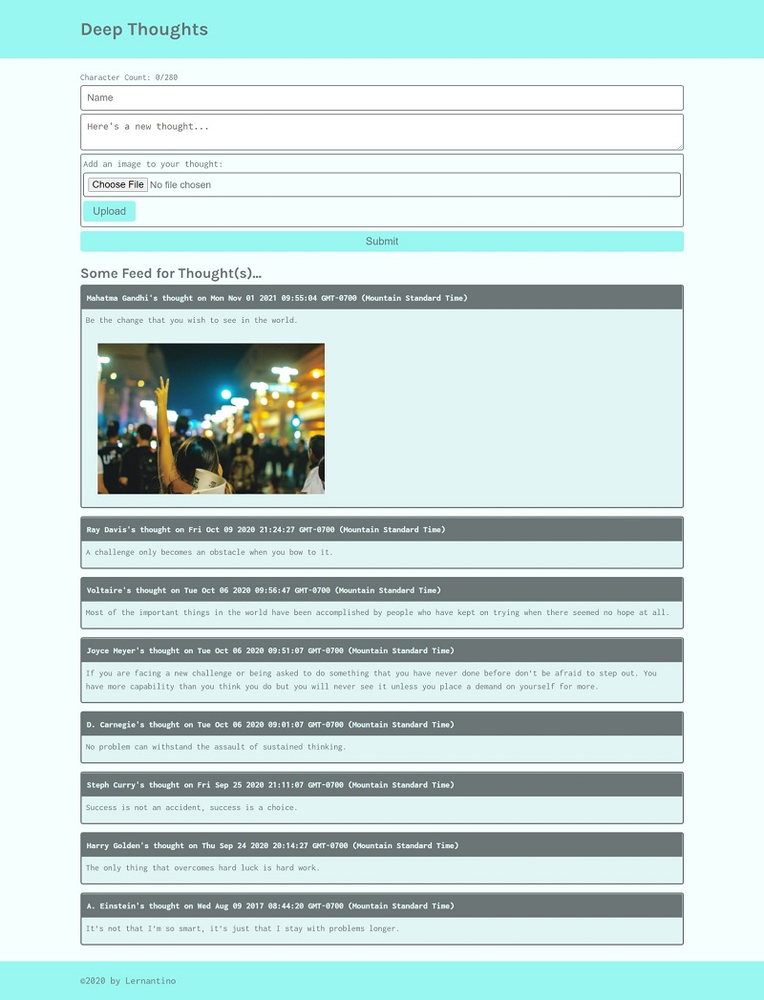
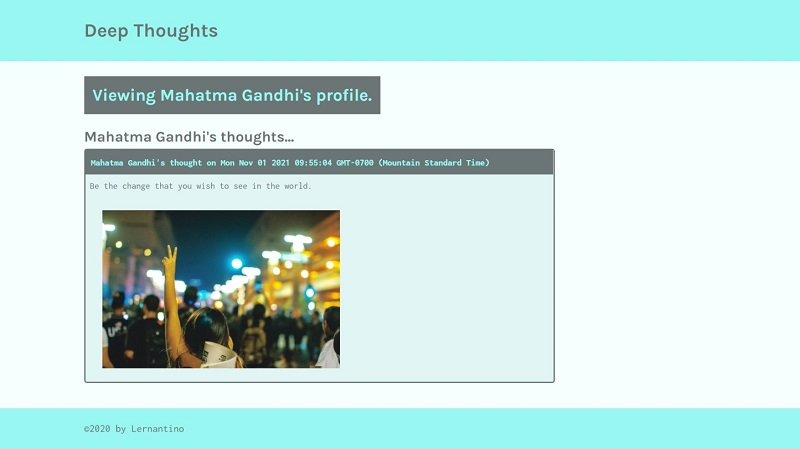

# AWS Thought List
---

## **Table of Contents**

* [Description](#Description) 

* [Usage](#usage)

* [Testing](#testing)

* [Technology](#technology)

* [Contribution](#contribution)

* [Questions](#questions)
---

## **Description**

An application that allows the user to upload a quote that can also include a small image or GIF (1MB or smaller) onto a website that is viewable by anyone. Through the use of AWS, the application is able to handle different components of the upload, viewing, and deployment of the AWS Thought List application to help make it more efficient for the user.  The DynamoDB service on AWS is able to handle smaller upload (500KB or smaller), such as text, while the S3 service will handle the larger images that are uploaded. AWS's EC2 instance then uploads the application to the AWS cloud infrastructure. Through the use of React, the application is run on a single page where the user can switch between viewing all the uploaded quotes and photos to the app, but can also easily view all the quotes from just one author.

---

## Usage

See the deployed version here through nginx! [Deployed link](http://3.138.201.27/)

---

## **Testing**

Below are screenshots showing the application.

You can see a video of the application in use at the following link.
https://drive.google.com/file/d/1I-9877eeHhc6MELCCo02AUwT6eMTCW6V/view?usp=sharing

---

## **Technology**

- React
- AWS (DynamoDB, S3, EC2)
- JavaScript
- NoSQL
- npm
- Node.js
- nginx

---

## **Contribution**

If you are looking to contribute the AWS Thought List app, you can find its repo at https://github.com/JMan4342/aws-thought1.

---

## **Questions**

If you have any questions, please feel free to reach out to me at manning.joseph.4342@gmail.com.